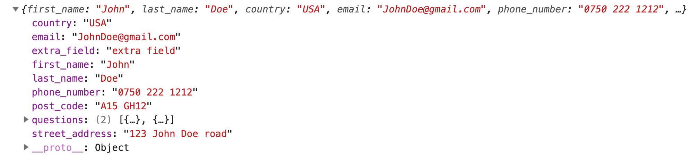
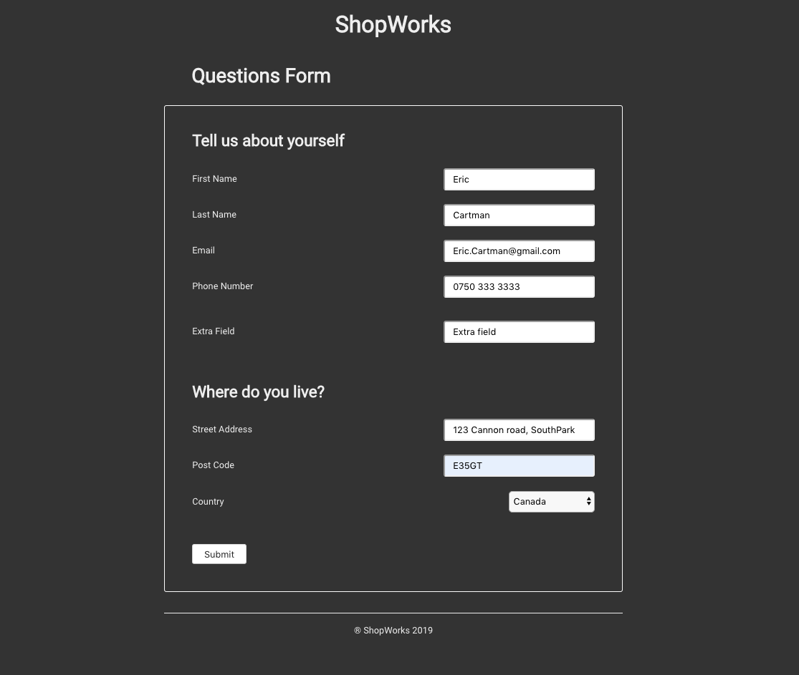
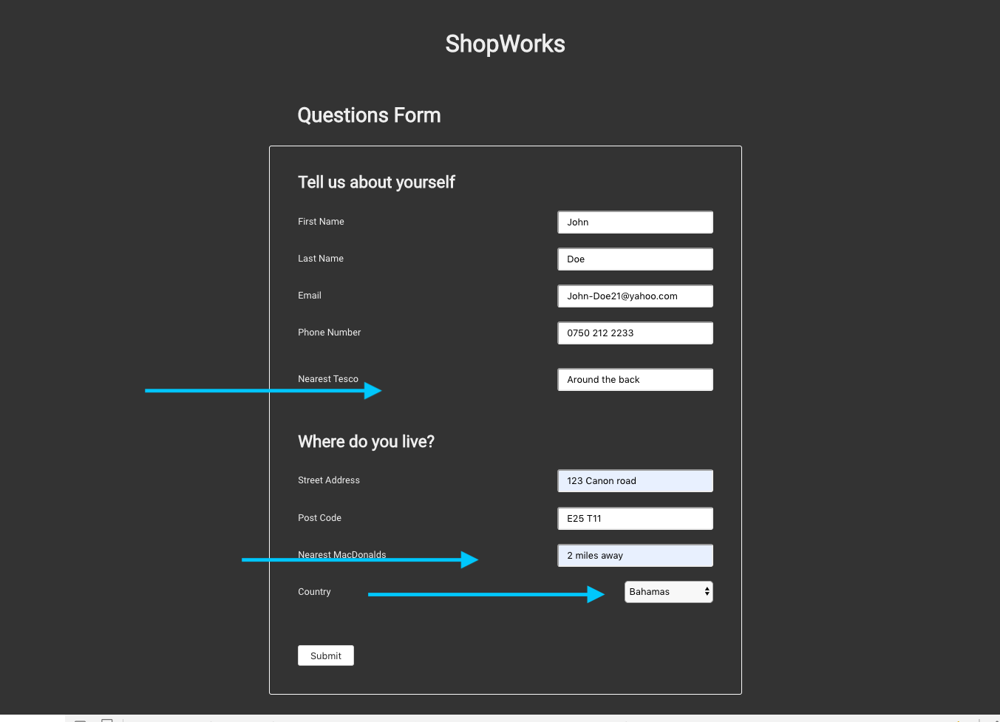
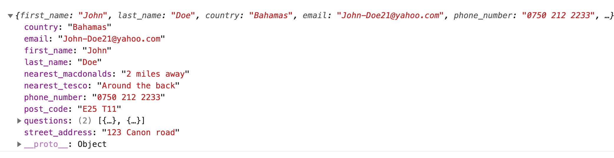

 &nbsp; 

## React Form Challenge &nbsp; &nbsp; :violin:

> bootstrapped with `Create-react-app`

### To install

  - `npm install` dependencies
  - `npm start`
  - open browser http://localhost:3000

### About Form 💊

  - `questions.json` is config file.  Add additional questions/fields here.
  - `Submit` button prints the form\'s current state to the console (form data).
  - `React` & `Styled` Comp css

### Sample JSON output 🗃️

 

 

 <kbd>Form</kbd>
 
 

<kbd>Form with Custom fields</kbd>

 
 

 

<kbd>New JSON Response data - it includes data for new fields</kbd>
 
 

:100:
